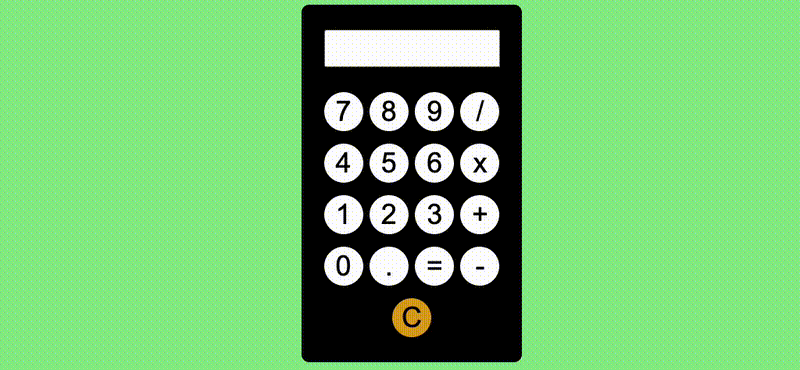

# 🔢 #100Devs Push Project001: Calculator

### Goal: Build a Simple Calculator using JS OOP best practices

[View Live Project](https://heidifryzell.com/photosite/)

### Tech Used:
  

## Related Projects
Here is my current portfolio:

<table border="1">
  <tr>
    <td style="text-align: center;"><a href="https://heidifryzell.com">heidifryzell.com</a></td>
  </tr>
  <tr>
    <td></td>
  </tr>
</table>
